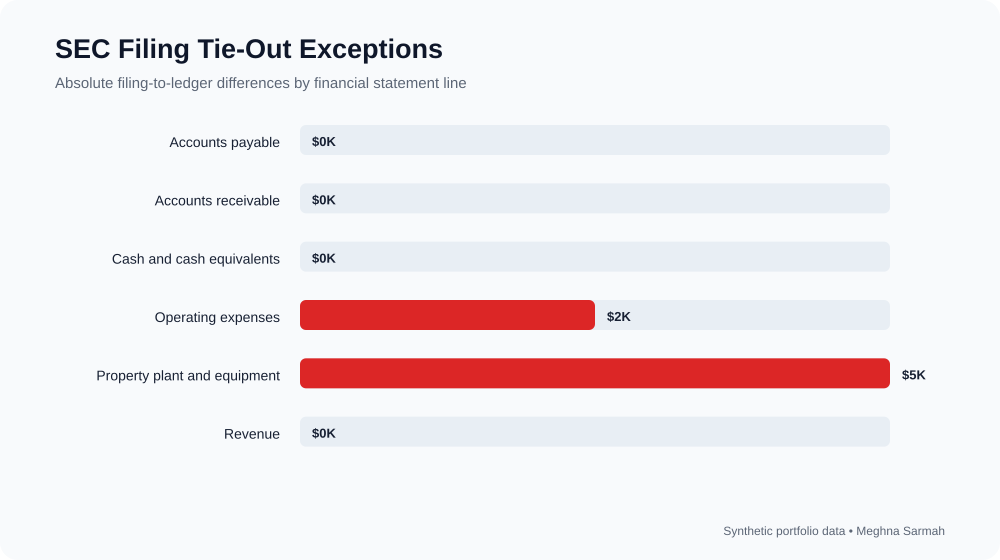

# SEC Reporting Tie-Out

A controlled financial-statement tie-out that compares draft filing balances with general-ledger support and flags discrepancies before review.

## Tie-out visualization



## Use case

SEC reporting teams must ensure that amounts presented in financial statements and disclosures agree to approved supporting schedules. This project demonstrates a simplified, auditable tie-out process.

## Checks

- Filing amount agrees to ledger support
- Difference is within defined tolerance
- Review status is assigned consistently
- Exceptions are exported for follow-up

## Run

```bash
pip install pandas
python tie_out.py
```

The project uses synthetic data and does not reproduce confidential client information.

## Business context

External reporting teams must demonstrate that every material amount in a filing agrees to approved support. A well-designed tie-out process creates evidence of review, identifies changes early, and reduces the risk of inconsistent figures appearing across financial statements and disclosures.

## Tie-out methodology

1. Import draft filing amounts and general-ledger support.
2. Match records using a standardized financial-statement line item.
3. Calculate the filing-to-ledger difference.
4. Apply a defined tolerance and assign **Tied** or **Review** status.
5. Export the complete tie-out and a separate exception list.

## Findings

- Cash, accounts receivable, accounts payable, and revenue agree to ledger support.
- Property, plant and equipment contains a **$5K difference**.
- Operating expenses contain a **$2.5K difference**.
- The exception report isolates both items so the reporting team can resolve or document them before filing.

## Reporting and control relevance

The workflow reflects the discipline used when supporting 10-K and 10-Q preparation: consistent support, documented tolerances, traceable differences, and clear reviewer follow-up. In a production environment, the output could be incorporated into a Workiva certification or close-management workflow.

## Repository structure

- **draft_filing.csv** — draft financial-statement values
- **ledger_support.csv** — supporting account balances
- **tie_out.py** — comparison and exception logic
- **tie_out_results.csv** — complete tie-out
- **exceptions.csv** — items requiring review

## Skills demonstrated

SEC reporting support, 10-K and 10-Q tie-outs, U.S. GAAP reporting, SOX-minded documentation, Workiva concepts, Python, and financial-statement review.
